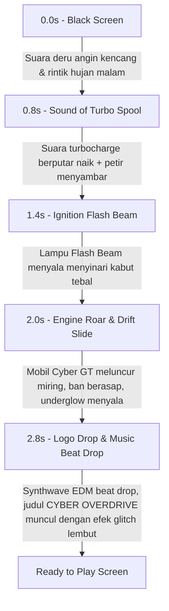

# 🏎️ CYBER OVERDRIVE — Official Opening Screen Poster & Concept Art Direction

> **Dokumen Spesifikasi Visual & Ilustrasi Poster Pembuka Game (Splash / Title Screen Key Art)**  
> **Tema Utama:** Cyberpunk 3D High-Speed Highway Racing, Dynamic Night Ambiance, Volumetric Fog & Rain Reflections.

---

## 1. Konsep & Identitas Poster

| Elemen | Spesifikasi |
| :--- | :--- |
| **Judul Game** | **CYBER OVERDRIVE: NIGHT HIGHWAY DRIFT** |
| **Tagline** | *"Survive the Asphalt. Master the Storm. Outrun the Neon Metropolis."* |
| **Target Mood** | Adrenalin tinggi, futuristik, atmosferik, sinematik, dingin sekaligus bertenaga (*high-contrast cyber-glow*). |
| **Sudut Pandang (Camera Angle)** | *Cinematic Ultra-Wide Low-Angle (15° Dutch Tilt)* setinggi 0.6 meter dari aspal basah, menyorot mobil utama yang sedang melakukan manuver *power-slide drift* melintasi jalur tol. |
| **Pencahayaan Dominan** | *Twin Xenon High-Beam Flashlights* (putih tajam) membelah kabut, *Cyan Neon Underglow* memantul di genangan air aspal hitam, serta kilatan petir tipis di langit gedung pencakar langit. |

---

## 2. Ilustrasi Visual & Komposisi Adegan (Visual Composition)

```
+---------------------------------------------------------------------------------------------------+
|  [SKYLINE]  Distant Megacity Skyscrapers & Holographic Neon Billboards (Cyan / Violet / Indigo)     |
|             Volumetric Midnight Rain & Fog Streaking Diagonally across the Screen                 |
|                                                                                                   |
|                                   ⚡ FLASH BEAM LIGHT CONE ⚡                                      |
|                                       \                   /                                       |
|                                        \                 /                                        |
|   [HERO CAR: CYBER GT / APEX PHANTOM]   \               /                                         |
|    - Warna Bodi: Deep Metallic Crimson Flame (#ef4444) & Carbon Fiber Splitter                     |
|    - Headlights: Ultra-Bright High-Beam Flashlight 6000K menembus kabut basah                     |
|    - Roda Depan: Belok ke arah kiri (*counter-steer*), velg alloy berputar cepat                   |
|    - Ban Belakang: Memercikkan tire smoke putih kebiruan & percikan gesekan jalan                |
|    - Sasis Bawah: Cahaya Neon Underglow Cyan (#06b6d4) membentuk bayangan tajam di aspal          |
|    - Knalpot Belakang: Twin Nitro Afterburner Flame (Biru Elektrik #00f0ff)                       |
|                                                                                                   |
|  [FOREGROUND ASPHALT]                                                                             |
|  - Aspal hitam mengkilap (*wet lacquer effect*) dengan pantulan marka jalan cyan & rose           |
|  - Tumpahan oli hitam pekat (*jet-black oil slick*) dengan efek refleksi glossy                   |
|  - Butiran hujan (*rain splashes*) memantul di permukaan jalan raya                               |
|                                                                                                   |
|                       =============================================                               |
|                                      C Y B E R                                                    |
|                                  O V E R D R I V E                                                |
|                       =============================================                               |
|                               [ ▶ ENTER THE HIGHWAY ]                                             |
+---------------------------------------------------------------------------------------------------+
```

---

## 3. Skema Palet Warna (Color Palette Architecture)

```
[ Deep Midnight ]       #0a101d  ████  Langit malam, dasar gedung, dan bayangan dalam
[ Wet Asphalt ]         #111827  ████  Permukaan aspal jalan tol dan genangan oli pekat
[ Xenon Flash White ]   #ffffff  ████  Lampu tembak utama (Flash Beam) & sambaran petir
[ Electric Cyan Neon ]  #06b6d4  ████  Underglow mobil, marka lajur jalan, dan aksen HUD
[ Sky Blue Glow ]       #38bdf8  ████  Pantulan kabut, partikel hujan, dan lampu kota
[ Flame Crimson ]       #ef4444  ████  Bodi mobil utama (Cyber Coupe) dan lampu rem belakang
[ Hazard Amber Gold ]   #f59e0b  ████  Indikator hazard, barier jalan tol, dan skor tinggi
```

---

## 4. Tipografi & Tata Letak Logo (Title & Typography)

1. **Main Game Logo:**
   - **Teks:** `CYBER OVERDRIVE`
   - **Font Style:** *Italicized Heavy Geometric Sans-Serif* (seperti *Chakra Petch*, *Orbitron*, atau *Rajdhani*).
   - **Gradasi:** Dari *Electric Cyan (#06b6d4)* di bagian atas, melalui *Crisp White (#ffffff)* di bagian tengah, hingga *Rose Crimson (#f43f5e)* di bagian bawah.
   - **Efek Tambahan:** *Chromatic Aberration* lembut (0.5px offset merah-biru) dan *Drop Shadow Neon Glow* (`box-shadow: 0 0 40px rgba(6, 182, 212, 0.6)`).

2. **Sub-Heading & Mode Badges:**
   - `SOLO ENDLESS SPRINT` • `FIREBASE REALTIME MULTIPLAYER` • `DYNAMIC WEATHER ENGINE`
   - Warna: Slate 300 dengan font monospace berjarak renggang (*letter-spacing: 0.25em*).

3. **Call-To-Action (CTA Button):**
   - Tombol utama: **`[ RACE NOW — PRESS ANY KEY / TAP TO START ]`**
   - Bingkai pil futuristik bergradasi cyan ke amber dengan animasi denyut (*subtle pulse animation*).

---

## 5. Storyboard Alur Transisi Screen Opening (Opening Sequence Animation)



- **Tahap 1 (0.0s - 0.8s):** Layar hitam pekat. Terdengar efek suara rintik hujan (*rain ambience*) dan hembusan angin malam berkecepatan tinggi.
- **Tahap 2 (0.8s - 1.4s):** Terdengar suara *starter engine* berfrekuensi rendah disusul *turbo spooling*. Kilatan petir tipis menerangi siluet mobil di kejauhan.
- **Tahap 3 (1.4s - 2.0s):** Sepasang lampu depan (*Xenon High-Beam*) menyala seketika dengan suara *click-relay*, memancarkan dua kerucut cahaya volumetrik yang menembus partikel hujan.
- **Tahap 4 (2.0s - 2.8s):** Mobil berakselerasi mendekati kamera, melakukan manuver *power-slide* di tikungan jalan tol basah. Cahaya *cyan underglow* menyapu genangan air aspal dengan cipratan halus.
- **Tahap 5 (2.8s+):** Musik synthwave memasuki *drop beat*, logo judul **CYBER OVERDRIVE** muncul di tengah layar, dan tombol navigasi Garage, Leaderboard, serta Multiplayer Lobby aktif untuk dimainkan.

---

## 6. Prompt Siap-Pakai untuk Image Generator (Midjourney / Stable Diffusion / DALL-E)

Bila Anda ingin merender gambar visual poster resolusi ultra-tinggi (4K/8K) di generator eksternal, gunakan prompt berikut:

### Widescreen Poster 16:9 (Desktop / Splash Screen):
```text
Cinematic action promotional game poster for a cyberpunk 3D highway racing game titled "CYBER OVERDRIVE". 
A sleek high-end futuristic red and carbon-fiber sports supercar drifting aggressively at high speed on a wet, rainy multi-lane highway at midnight. 
Twin high-intensity xenon flash beam headlights piercing through dark atmospheric mist and rain streaks. 
Vibrant cyan neon underglow reflecting off glossy black puddles and asphalt. 
Massive futuristic cyberpunk skyscrapers with holographic vertical neon billboards and distant cyber grid in the background. 
Blue nitro exhaust flames erupting from the rear. 
Dramatic low-angle dynamic camera angle, motion blur on road markers, highly detailed octane 3D render, photorealistic lighting, 8k resolution, cinematic color grading. --ar 16:9 --style raw --v 6.1
```

### Vertical Poster 9:16 (Mobile Wallpaper / Social Media Story):
```text
Vertical key visual game cover poster for high-speed cyberpunk arcade racing game. 
Front three-quarter dramatic low-angle perspective of a custom red aerodynamic GT hypercar speeding towards the camera through midnight rain and volumetric fog. 
Ultra-bright white headlights cutting through water droplets, glowing electric cyan chassis underglow lighting the wet tarmac. 
Towering glowing cyber city towers disappearing into dark stormy clouds above. 
Speed line trails, high adrenaline mood, cinematic poster composition with clean negative space at top for game title logo, 8k quality, unreal engine 5 render look. --ar 9:16 --v 6.1
```

---

## 7. Integrasi di Game

Poster konsep ini selaras dengan fitur teknis yang berjalan di aplikasi:
- **3D Engine:** Menggunakan Three.js WebGL Renderer dengan pencahayaan *Ambient*, *Directional Light*, *SpotLight Flash Beams*, dan *PCFShadowMap*.
- **Dynamic Weather System:** Hujan 3D (*particle rain*), kabut densitas tinggi (*exponential fog*), dan lantai jalan basah (*wetness reflection*).
- **Physical Tires:** Roda 3D dengan kemudi *steering knuckle* independen untuk visual belok kiri dan kanan yang realistis.
- **Endless Track:** Menjelajahi tol siber tanpa batas jarak untuk rekor skor tertinggi.
